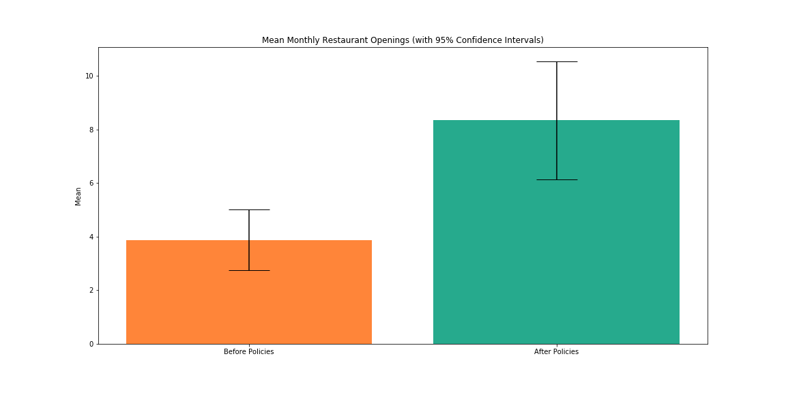

# Economic Development in Durham, North Carolina
In 2012, the city of Durham, North Carolina has launched a series of social and
economic policies with the goal of transforming the once crime-ridden city into
a vibrant and progressive community. Anecdotal evidence suggests the policies
have greatly impacted the city’s economic landscape. Through statistical rigor,
we can validate this assertions. Using restaurant openings as a proxy for business
development, this report intends to measure the efficacy of the city’s initiatives.

## Data Description
The first step in measuring the effectiveness of economic initiatives is to
collect the appropriate data. Fortunately, as part of the progressive social
policies, Durham has embraced an open data portal, making city data readily
available for analysis. The city has published a data set containing all
restaurant openings from January 1990 to February 2017. To facilitate analysis,
the data was collapsed into monthly categories, summing up the number of openings
in a given month. The analysis focused on the sixty months periods before and
after the 2012 initiatives, discarding all other months. Figure 1 shows a scatter
plot of openings from January 2007 to December 2016.

###### Figure 1

Summary statistics for the period prior to initiatives show monthly restaurant
openings had a minimum of 0, and maximum of 9, a mean of 3.88, a mode of 3, and
a variance of 4.88. Skewness of 0.3 and kurtosis of -0.66 represent a fairly
normal distribution of restaurant openings. The sample following the initiatives
had a minimum of 2 restaurants open in a single month, with a maximum of 22. The
mean for this data set was 8.35, with a mode of 5 and mean of 8.35. Variance was
18.2. Skewness of 1.16 and kurtosis of 1.44 show this data set was largely
centered around its mean, and was influenced by outlier months. Table 1 provides
an overview of summary statistics for each sample. Mean monthly restaurant
openings with 95% confidence intervals can be seen in figure 2.
 
###### Table 1
| Statistic | Before | After |
|---|---|---|
| n | 60 | 60 |
| Minimum | 0 | 2 |
| Maximum | 9 | 22 |
| Mode | 3 | 5 |
| Mean | 3.88 | 8.35 |
| Variance | 4.88 | 18.2 |
| Skewness | 0.3 | 1.16 |
| Kurtosis | -0.66 | 1.44 |
| 95% CI (Low) | 3.31 | 7.25 |
| 95% CI (High) | 4.45 | 9.45 |

###### Figure 2

## Data Analysis
Since data has been aggregated into sixty months before and sixty months after
the implementation of economic initiatives in 2012, it is an ideal candidate for
two sample t-test. The two sample t-test allows us to identify significant
differences in mean monthly openings between two equally sized samples.
Identifying significant differences is predicated upon formulation of null
and alternative hypotheses. In our case, the null hypothesis is equal mean
monthly restaurant opening before and after initiatives, and the alternative
hypothesis is unequal means.

As seen in table 2, conducting the two sample t-test yielded a t-statistic of
7.61 and a p-value of 0.001. The t-critical value with an alpha of 0.05 and 59
degrees of freedom is 1.67. Since the t-statistic is much larger that the
provided t-critical value, we can reasonable reject the null hypothesis. This is
corroborated by the analysis’ p-value. This value is markedly smaller than a
significance value.
 
###### Table 2
| T-Statistic | P-Value |
|---|---|
| 7.61 | 2.5456860025032486e-10 |

It is important to note that this analysis is rather naive, not accounting for
factors external to the city. That is to say, while there is a positive
relationship between the initiation of economic policies and restauranteurship
in the city, we cannot solely attribute restaurant success to the cities policies.
It is also worth noting that the data published by the city only relates to
restaurant openings. It does not make note of restaurant closings. It is possible
that restaurants in the list are reopenings or assuming locations of previous
failed restaurants. As such, the volume of openings may not tell a complete
story of restauranteurship in Durham, North Carolina. Nevertheless, it does
demonstrate a relationship between initiatives and restaurant openings.

Considering the perceived success of the initiatives, Durham, North Carolina
should continue to incentivize entrepreneurship. At the very least, the city
will generate additional data points for analysis, leading to a more accurate
decision. More likely, the city will continue to reap the economic benefits of
restauranteurship as new restaurants will add additional variety to the city’s
downtown encouraging tourism and stimulating the economy. 
